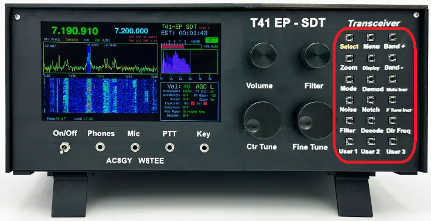
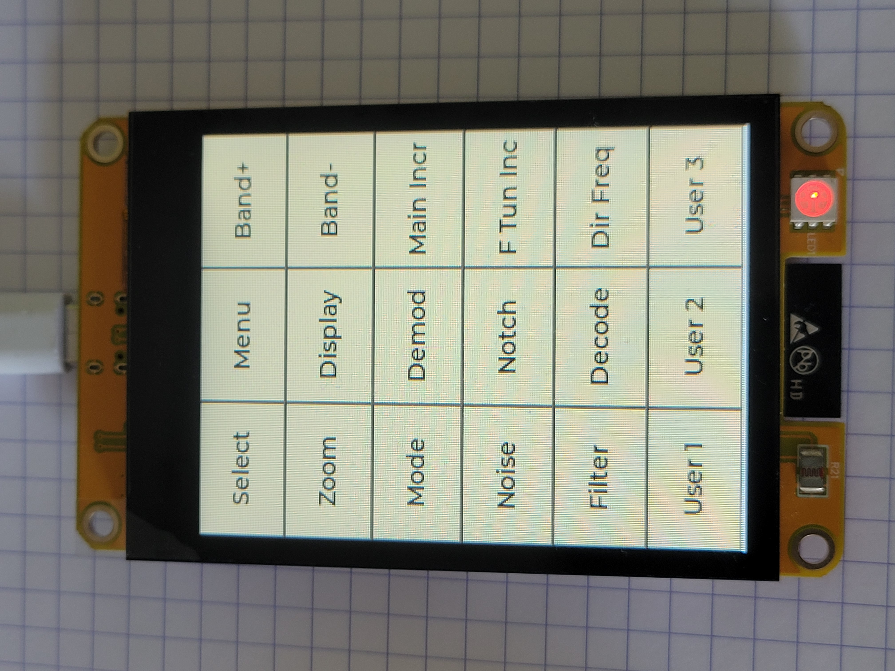

# T41 SDR Side Button Display

This project replaces the mechanical switch array on the T41 EP-SDT software-defined radio transceiver with a touchscreen display.

## The problem

The T41 EP-SDT has 18 mechanical push buttons on its right side panel for functions like band selection, mode, filter, zoom, and more. These buttons are functional but bulky, require wiring, and offer no visual feedback.

## The solution

An ESP32-based CYD (Cheap Yellow Display) 3.2" touchscreen module replaces all 18 mechanical buttons with a touch-sensitive 6x3 button grid. The display is oriented in portrait mode so the button columns align vertically along the side of the transceiver.

## Button layout (3 columns x 6 rows)

| Col 1   | Col 2   | Col 3      |
|---------|---------|------------|
| Select  | Menu    | Band+      |
| Zoom    | Display | Band-      |
| Mode    | Demod   | Main Incr  |
| Noise   | Notch   | F Tun Inc  |
| Filter  | Decode  | Dir Freq   |
| User 1  | User 2  | User 3     |

Buttons support both momentary and toggle modes. Toggle buttons change the background color to orange when active.

## Hardware

- **Display module**: ESP32-2432S032C (CYD 3.2") with ST7789 SPI display
- **Touch controller**: GT911 capacitive touch (I2C)
- **MCU**: ESP32-D0WD-V3, 240 MHz dual core
- **Resolution**: 240x320 (portrait, rotation 2)
- **Communication**: I2C slave (MCP23017 emulation) to the T41 main board

## Software

- LVGL 8.3.11 for UI rendering
- Arduino_GFX library for display driver
- TAMC GT911 library for touch input
- Built with arduino-cli, ESP32 Arduino Core 3.3.6
